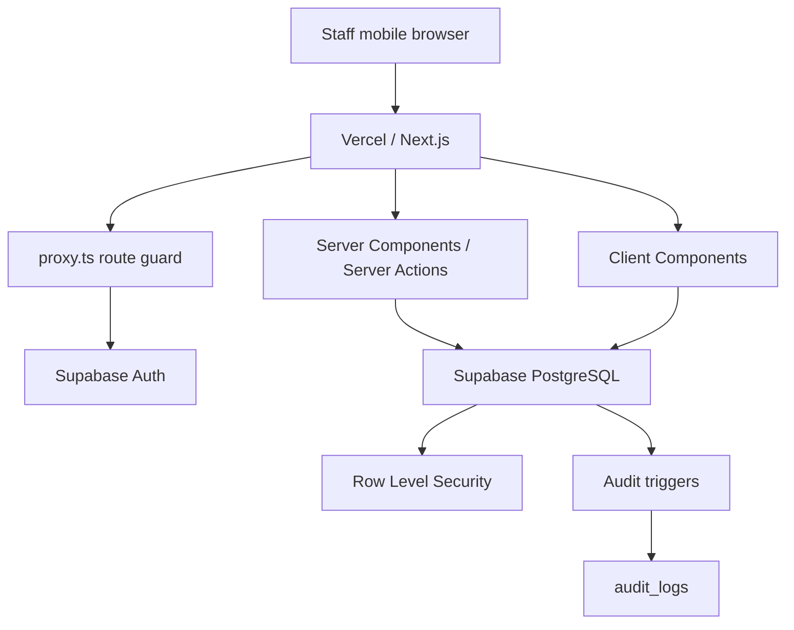

# Wenxin Management App Architecture

> 文档角色：项目架构的唯一入口（Architecture Source of Truth）
>
> 最后核对：2026-06-06
>
> 当前生产环境：[https://app.eatwenxin.com](https://app.eatwenxin.com)
>
> GitHub：`Mrtick0720/wenxin-app`

## 0. 所有协作模型必须先读

任何 Claude、Codex 或其他开发模型在分析或修改项目之前，必须依次阅读：

1. `ARCHITECTURE.md`：系统边界、技术架构、业务流程。
2. `INTERFACE.md`：数据结构、权限、函数与模块通信契约。
3. `TASK_LOG.md`：当前完成状态、未完成事项、开发锚点。

不得只根据聊天记录推断当前状态。不得未经 Bruce 确认修改现有页面设计、权限规则、数据库结构或生产数据。

## 1. 项目定义

Wenxin Management App 是文心餐厅的内部运营 Web App，服务于 Owner、Manager、Kitchen 和 Front Desk。

当前核心目标：

- Owner 查看餐厅经营与运营状态。
- 员工在自己的设备登录并按职位处理业务。
- Bento 客户、订阅餐期、订单与出餐协作。
- 采购清单的录入、更新和完成确认。
- 员工账号、12 小时登录会话和重要操作审计。

未来目标：

- 顾客端 Bento 口味与配送选择。
- 员工个人资料、排班、考勤和审批。
- POS 数据接入、库存联动、财务报表。
- 多门店、多语言和更细的岗位权限。

## 2. 当前技术栈

本项目不是 Google Sheets + Glide。当前生产架构如下：

| 层级 | 当前选择 | 职责 |
|---|---|---|
| Web Framework | Next.js 16 App Router | 页面、Server Components、Server Actions、路由保护 |
| UI | React 19 + TypeScript | 交互组件与类型约束 |
| Styling | Tailwind CSS 4 + `app/globals.css` | 移动优先界面与全局动画 |
| Animation | Framer Motion + CSS transitions | 页面和局部交互动画 |
| Database | Supabase PostgreSQL | 业务数据、员工资料、会话、审计记录 |
| Authentication | Supabase Auth + `@supabase/ssr` | Staff ID 登录、Cookie 会话 |
| Authorization | Next.js route guards + PostgreSQL RLS | 页面和数据库双层权限 |
| Hosting | Vercel | Production deployment |
| Source Control | GitHub | `Mrtick0720/wenxin-app`, branch `main` |
| Tests | Node assertion scripts + ESLint + TypeScript + Next build | 核心规则和构建验证 |

## 3. 系统边界

### 3.1 当前系统负责

- 员工账号及角色权限。
- Bento 客户、订阅餐期、每日订单、出餐状态、周菜单和未付款列表。
- 采购项目及采购明细。
- 当日任务和事故列表。
- Owner 的 Staff Accounts 与 Activity Log。
- 部分首页经营和运营数据展示。

### 3.2 当前系统不负责

- 现场 POS 点单、收银、退款和打印。
- 完整会计、工资或库存核算。
- 顾客公开注册和顾客登录。
- 员工身份证、地址、紧急联系人等 HR 档案。
- App Store / Google Play 原生应用发布。
- 生物识别登录。未来应使用 Passkey，不直接保存指纹或图案密码。

## 4. 高层架构



安全原则：

1. 导航隐藏不是权限本身。
2. 页面必须经过 `proxy.ts` 或服务端 `requireRole()` 检查。
3. 浏览器直接访问数据库仍必须经过 RLS。
4. `SUPABASE_SERVICE_ROLE_KEY` 只能存在于服务端。
5. 密码、Token 和 Secret 不得进入日志。

## 5. 目录与模块结构

```text
wenxin-app/
├── app/
│   ├── page.tsx                    # Home
│   ├── login/                      # Staff login
│   ├── change-password/            # Mandatory password change
│   ├── profile/                    # Current staff and logout
│   ├── bento/                      # Bento overview and submodules
│   │   ├── customers/              # Customer and subscription calendar
│   │   ├── production/             # Production view
│   │   ├── weekly-menu/            # Weekly menu
│   │   ├── unpaid/                 # Unpaid orders
│   │   └── new/                    # Manual order entry
│   ├── purchase/                   # Purchase list and detail
│   ├── staff/
│   │   ├── accounts/               # Owner-only account management
│   │   └── activity/               # Owner-only sessions and audit
│   ├── tasks/ incidents/ ...        # Operational modules
│   ├── api/session/heartbeat/       # Session last-seen heartbeat
│   └── components/                 # Shared UI and navigation
├── lib/
│   ├── auth/                        # Roles, permissions, current staff
│   ├── supabase/                    # Browser, server, admin, proxy clients
│   ├── subscriptionSchedule.ts      # Bento subscription schedule engine
│   ├── bentoInteractionUtils.ts     # Bento gestures and panel rules
│   └── dateUtils.ts                 # Shared local-date helpers
├── supabase/migrations/             # Versioned database changes
├── scripts/                         # Owner bootstrap and rule tests
├── docs/superpowers/                # Detailed historical specs and plans
├── ARCHITECTURE.md                  # Architecture source of truth
├── INTERFACE.md                     # Interface source of truth
└── TASK_LOG.md                      # Current development source of truth
```

## 6. 核心业务流程

### 6.1 员工登录

1. Owner 创建 Staff ID、Display Name、Role 和临时密码。
2. 员工以 Staff ID 和密码登录。
3. Staff ID 在服务端映射为内部 Auth identity。
4. 系统创建最长 12 小时的 `staff_sessions` 记录。
5. 首次登录或密码重置后，必须先修改密码。
6. 页面权限由角色决定，数据库权限由 RLS 再次验证。
7. 员工登出、超时、被强制登出或停用后，会话终止。

### 6.2 Bento 订阅与订单

1. Owner、Manager 或 Front Desk 创建 Bento Customer。
2. 输入 `start_date` 和 `total_portions`。
3. `buildSubscriptionPlan()` 从开始日期铺设餐期：
   - 默认一天一餐。
   - 自动跳过周六和周日。
   - 公共假期保留在日历并显示提醒，不自动扣除餐期。
4. 每个有效餐期对应一条 `bento_subscription_days`。
5. 系统为有效餐期创建或同步 `bento_orders`。
6. 某日标为 `skipped` 时：
   - 当日不计入已安排餐数。
   - 对应订单改为 `canceled`。
   - 结束日期自动向后延至下一个工作日。
7. 恢复餐期时重新加入计数，并同步订单。
8. 修改口味、时段或备注时，同时更新餐期及其关联订单。
9. 当日有效订单出现在 Bento overview 和 Portions Breakdown。

### 6.3 Bento 出餐

1. 当日订单按日期从数据库读取。
2. Owner、Manager、Front Desk 可看到获授权的订单与顾客信息。
3. Kitchen 通过 `bento_kitchen_orders` 限制视图读取生产所需字段。
4. Kitchen 只能通过 `set_bento_order_status()` 更新履约状态。
5. 取消订单不进入当日有效订单统计。

### 6.4 采购

1. Owner、Manager 或 Kitchen 按日期查看 `purchase_items`。
2. 员工录入品名、类别、单位、数量和单价。
3. 系统计算 `total_price = quantity * unit_price`。
4. 明细页可补充 Supplier、Purchase Method 和 Note。
5. 状态在 `pending` 与完成状态之间更新。
6. 数据保存到共享 Supabase 数据库，Owner 可实时查看。
7. 新增、修改和删除由数据库 Trigger 写入 `audit_logs`。

### 6.5 Activity Log

1. 登录、登出、密码修改和账号管理动作写入审计。
2. 关键业务表的 insert/update/delete 由数据库 Trigger 记录。
3. Owner 可查看员工会话、最近活动和重要数据变更。
4. 系统不记录每次点击、滚动、按键或员工密码。

## 7. 角色边界

| 模块 | Owner | Manager | Kitchen | Front Desk |
|---|---:|---:|---:|---:|
| Home | Full | Operational + totals | Limited | Limited |
| Bento orders | Full | Full | Production-limited | Full |
| Bento customers | Full | Full | No | Full |
| Bento production | Full | Full | Full | No |
| Weekly menu | Edit | Edit | View | View |
| Purchase | Full | Full | Full | No |
| Inventory | Full | Full | Full | No |
| Reports | Full | View | No | No |
| Finance | Full | No | No | No |
| Staff operations | Full | Yes | No | No |
| Staff accounts/activity | Full | No | No | No |

以 `lib/auth/permissions.ts` 和 Supabase RLS 为当前可执行事实。修改角色权限时，必须同时更新：

- Route matrix
- Navigation visibility
- Server guards
- RLS policies
- `INTERFACE.md`
- 权限测试

## 8. 部署与环境

生产部署：

- Domain：`https://app.eatwenxin.com`
- Deployment：Vercel
- Database/Auth：Supabase
- Source branch：GitHub `main`

必需环境变量：

```dotenv
NEXT_PUBLIC_SUPABASE_URL=
NEXT_PUBLIC_SUPABASE_ANON_KEY=
SUPABASE_SERVICE_ROLE_KEY=
OWNER_STAFF_ID=
OWNER_DISPLAY_NAME=
OWNER_INITIAL_PASSWORD=
```

规则：

- `.env*` 不提交 Git，只有 `.env.example` 可提交。
- 数据库修改必须新增 migration，不得只在 Dashboard 手工修改。
- Production migration 必须在代码合并后有明确记录。
- 部署前必须执行 `TASK_LOG.md` 的验证清单。

## 9. 扩展原则

### 9.1 多门店

未来核心业务表统一增加 `store_id`。权限应从单纯 Role 扩展为 Role + Store Membership。

### 9.2 顾客端

顾客端必须使用独立身份和权限，不复用员工角色。顾客只能访问自己的订阅、口味、暂停日和配送资料。

### 9.3 POS

优先只读接入现有 POS API；如果无 API，使用受控 CSV 导入。不要在当前阶段自研完整 POS。

### 9.4 原生 App

当前 Web App 逻辑应保持数据层与 UI 分离，为未来 React Native 客户端复用 Supabase Schema 和 RPC。

## 10. 架构决策规则

- 新功能先更新三份核心文档，再写代码。
- 不确定的历史设计不得覆盖已经运行的生产逻辑。
- UI 恢复或重设计必须与认证、权限逻辑分开提交。
- 一个提交只处理一个清晰主题。
- 任何数据库字段变更必须同步更新 `INTERFACE.md`。
- 每次完成开发后，必须更新 `TASK_LOG.md` 的状态、验证结果和 Git commit。

## 11. 参考资料

- `INTERFACE.md`
- `TASK_LOG.md`
- `docs/superpowers/specs/2026-06-06-staff-authentication-design.md`
- `docs/superpowers/plans/2026-06-06-staff-authentication-implementation.md`
- `../My Knowledge Base/文心/08_项目/餐厅管理App_PRD.md`

